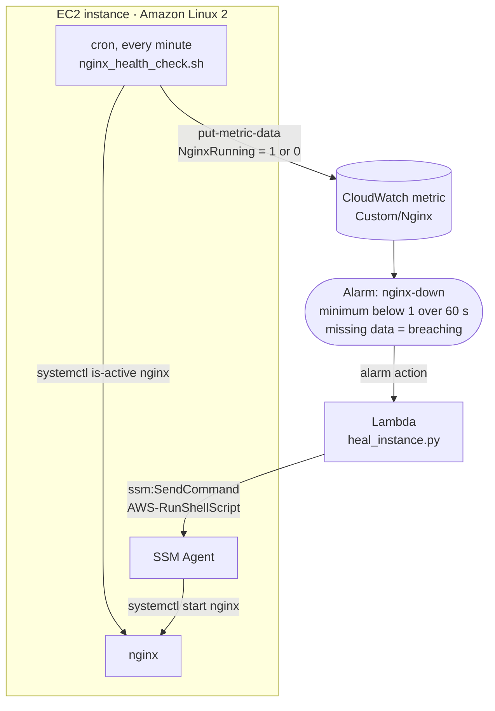

# self-healing-infra

An nginx web server on EC2 that repairs itself. A health check on the instance
reports to CloudWatch every minute. When nginx goes down, or the instance stops
reporting, a CloudWatch alarm invokes a Lambda function that restarts nginx through
AWS Systems Manager. No SSH, no one paged. Everything is provisioned with Terraform.

**Stack:** AWS (EC2, CloudWatch, Lambda, Systems Manager, IAM) · Terraform ·
Python (boto3) · Bash

## How it works



1. **Detect.** The instance's user data (`scripts/install_nginx.sh`) installs nginx,
   the CloudWatch agent and a health-check script that cron runs every minute. The
   script publishes `NginxRunning` to the `Custom/Nginx` namespace: `1` when
   `systemctl is-active nginx` succeeds, `0` when it doesn't.
2. **Decide.** The `nginx-down` alarm goes into `ALARM` when the metric's minimum
   over a 60-second period drops below 1. Missing data counts as breaching, so an
   instance that stops reporting is treated as unhealthy too.
3. **Heal.** The alarm invokes the `self-healing-lambda` function, which uses SSM
   Run Command (`AWS-RunShellScript`) to run `systemctl start nginx` on the
   instance. The instance needs no inbound SSH; its instance profile lets the SSM
   Agent receive commands.

## What Terraform creates

| File | Resources |
| --- | --- |
| `terraform/ec2.tf` | A `t3.micro` Amazon Linux 2 instance bootstrapped by `scripts/install_nginx.sh`, and a security group that allows HTTP in |
| `terraform/iam.tf` | The instance role (`AmazonSSMManagedInstanceCore`, `CloudWatchAgentServerPolicy`), the Lambda role (`ssm:SendCommand` plus CloudWatch Logs), and the permission that lets the alarm invoke the function |
| `terraform/cloudwatch.tf` | The `nginx-down` metric alarm, with the Lambda function as its action |
| `terraform/lambda.tf` | The Python 3.10 healer, packaged from `lambda/heal_instance.zip`, with the instance ID passed in as an environment variable |
| `terraform/variables.tf` | `region` (default `us-west-2`) and `instance_type` (default `t3.micro`) |

## Deploy

You need Terraform and AWS credentials for an account where you can create EC2,
IAM, Lambda and CloudWatch resources. The AMI ID in `ec2.tf` is for `us-west-2`,
and `iam.tf` pins the AWS account allowed to invoke the function, so change both if
you deploy somewhere else.

```bash
# rebuild the Lambda package after changing the handler
(cd lambda && zip -j heal_instance.zip heal_instance.py)

cd terraform
terraform init
terraform apply        # prints instance_id and public_ip
```

## Try it

Open `http://<public_ip>` to see the nginx welcome page. Then break it from a
Session Manager shell (no SSH key needed; the AWS CLI needs the Session Manager
plugin):

```bash
aws ssm start-session --target <instance_id>
sudo systemctl stop nginx
```

Watch the `nginx-down` alarm go into `ALARM` in the CloudWatch console, check the
function's log group (`/aws/lambda/self-healing-lambda`) for the invocation, and
reload the page once nginx is back.

## Clean up

```bash
cd terraform && terraform destroy
```

## Design notes

- **SSM instead of SSH.** The Lambda never holds a key and the security group never
  opens port 22. IAM decides who can run commands on the instance, and Systems
  Manager records every command it runs.
- **Silence is a failure.** If the instance hangs or the cron job dies, the metric
  goes quiet. Treating missing data as breaching means silence trips the alarm
  instead of hiding the problem.
- **One instance, one action.** The function heals the single instance whose ID
  Terraform passes in. CloudWatch runs alarm actions when the alarm changes state,
  so if a restart doesn't bring nginx back, the alarm stays in `ALARM` and nothing
  retries. Retrying with a limit, and notifying someone when healing fails, are the
  natural next steps.
